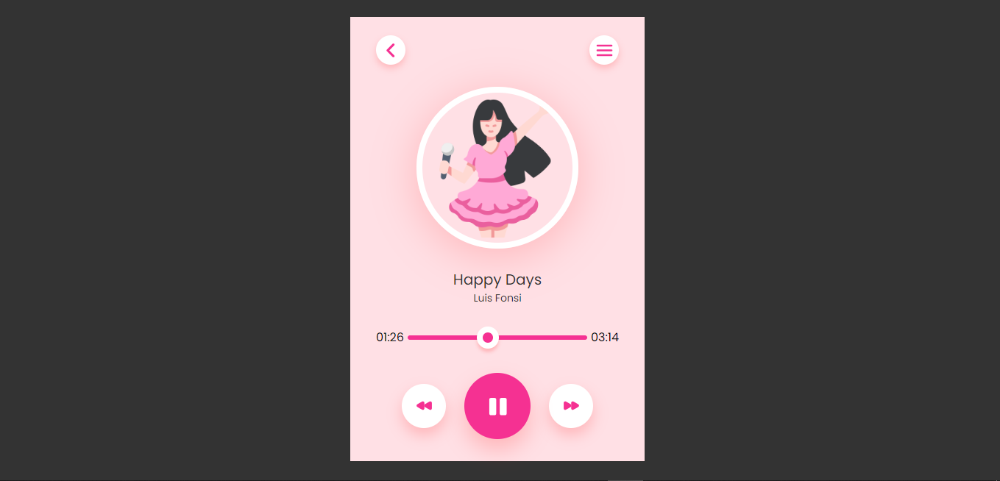

# Basic Music Player

This is a basic music player project using HTML, CSS, and JavaScript.


## Getting Started

Clone the repository or download the project files.
Open the index.html file in a web browser.

```bash
  git clone https://github.com/DeepakKumarVermaRamgarh/MusicPlayer
```
    
## Features

The "Music Player" project allows users to play and control audio tracks. It features a user interface with song information, a progress bar, and playback controls such as play, pause, next, and previous buttons.


## Usage/Examples

- Upon opening the web page, the default song "Happy Days" by Luis Fonsi will be loaded.
- The song title, artist, and thumbnail image are displayed.
- Use the controls to play or pause the song, navigate to the next or previous song, and seek to different positions in the song using the progress bar.
- Additional songs can be added to the songs array in the JavaScript code, specifying the song title, source URL, and artist.
- Modify the HTML and CSS as needed to customize the appearance and functionality of the music player.


## Roadmap

Here is a brief overview of each file in the repository:

- index.html - This file contains the HTML code for the project.

- styles.css - This file contains the CSS code that styles the project.

- script.js - This file contains the JavaScript code.

- README.md - This file provides instructions on how to run the project.
## Authors

This project was created by Deepak Kumar Verma.
- [@DeepakKumarVermaRamgarh](https://github.com/DeepakKumarVermaRamgarh/)


## Screenshots


